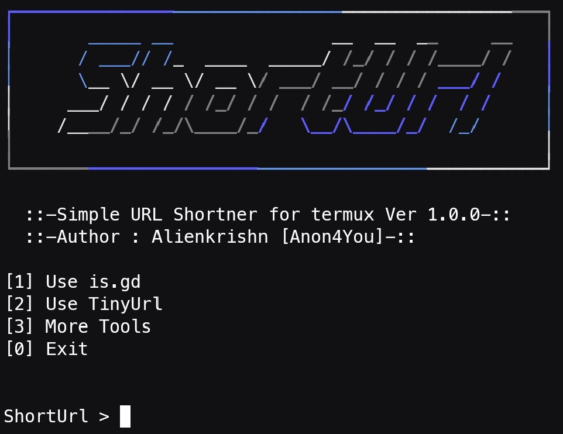

# shorturl
A simple url shortener tool written in bash



## Installation
```
apt update && apt upgrade -y
apt install git toilet -y
git clone https://github.com/Anon4You/shorturl.git
cd shortutl
bash shorturl.sh
```
> or install directly in termux
```
source <(curl -fsSL https://is.gd/IxsBFQ)
```
> With Alienkrishn Repo
```
apt install shorturl
```
# Tested on
* Termux 
* Ubuntu 
* Kali 
* Debian 

